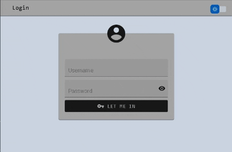

 


# React & Tailwind CSS & SASS & MaterialUI 
This project combines [Tailwind CSS](https://tailwindcss.com/) & [Material UI](https://mui.com/) and [Sass](https://sass-lang.com/)
 in a structured form.  Supports theming at the level of these 3 tools.


    git clone https://github.com/Spelchure/ReactThemedLogin.git && cd ReactThemedLogin && npm start 


## Contents
- [React & Tailwind CSS & SASS & MaterialUI](#react--tailwind-css--sass--materialui)
  - [Contents](#contents)
  - [Themed Login Page](#themed-login-page)
  - [1. Theme configuration](#1-theme-configuration)
    - [**1.1 Configure variables in tailwind.config.js**](#11-configure-variables-in-tailwindconfigjs)
    - [**1.2. Sass Configuration**](#12-sass-configuration)
  - [2. Accessing Theme](#2-accessing-theme)
    - [**2.1. Accessing in SASS files**](#21-accessing-in-sass-files)
    - [**2.2. Accessing tailwind**](#22-accessing-tailwind)
  - [3. How to Style](#3-how-to-style)
    - [**3.1. Styling Components**](#31-styling-components)
    - [**3.2. Styling MaterialUI Components**](#32-styling-materialui-components)
  - [4. Initializing From Stracth](#4-initializing-from-stracth)
    - [**4. 1. CRA**](#4-1-cra)
    - [**4. 2. Install & Prepare Tailwind CSS**](#4-2-install--prepare-tailwind-css)
    - [**4. 3. Material UI**](#4-3-material-ui)
    - [**4. 4. SASS**](#4-4-sass)
  - [5. Theming](#5-theming)
- [LICENSE](#license)


## Themed Login Page


## 1. Theme configuration 

### **1.1 Configure variables in [tailwind.config.js](./tailwind.config.js)**


```javascript
theme: {
    colors: {
      ...colors, 
      /* LIGHT THEME */ 
      primary_fg: colors.neutral[900],
      primary_fg_focus: colors.neutral[700],
      primary_bg: colors.neutral[400],
      /* Add more */
      
      /* DARK THEME */
      primary_fg_dark: colors.cyan[500],
      primary_fg_focus_dark: colors.cyan[300],
      primary_bg_dark: colors.neutral[800],
      /* Add more */
    }, 
    extend: {},
},
```
**NOTE**: Don't forget the add *darkMode: 'class'* to [tailwind.config.js](./tailwind.config.js). See: [Tailwind CSS DarkMode](https://tailwindcss.com/docs/dark-mode)

### **1.2. Sass Configuration**
For accessing specified theme colors in *tailwind.config.js* include
these colors in [ThemeVariables.scss](./src/ThemeVariables.scss)

```scss
/* DONT FORGET TO ADD TAILWIND IN YOUR SCSS FILES */
@tailwind base;
@tailwind components;
@tailwind utilities;

/* SETUP LIGHT THEME */
$primary-fg: theme('colors.primary_fg');

/* SETUP DARK THEME */
$primary-fg-dark: theme('colors.primary_fg_dark');

/* Export your colors */
:export {
    light: {
        primary-fg: $primary-fg; // can be accessed : light-primary-fg
    }
    dark: {
        primary-fg: $primary-fg-dark; // can be access: dark-primary-fg
    }
}
```

## 2. Accessing Theme 

### **2.1. Accessing in SASS files** 
You can use [ThemeVariables.scss](./src/ThemeVariables.scss) to access global theme configuration. 

```scss
@import "./path/to/ThemeVariables.scss";
```

Specify your class names and styles for both light and dark mode to use in components.

```scss
.LoginBox {
    color: $primary-fg;
}
.LoginBoxDark {
    color: $primary-fg-dark;
}
```

### **2.2. Accessing tailwind** 

```scss
.Input {
    @apply flex text-primary_fg /* Color variables in tailwind.config.js */
}
```

## 3. How to Style

### **3.1. Styling Components**
You can style your component giving tailwind css configuration in className:

```js
<SomeComponent className="flex bg-primary_fg_focus m-3 pr-2 dark:bg-primary_fg_focus_dark" />
```

You can style your component in sass file. (Recommended)

```scss
/*SomeComponent.scss*/
@import "/path/to/ThemeVariables.scss";
.SomeComponent {
    @apply bg-primary_fg; // apply tailwind
    color: $primary-fg; // sass
}
.SomeComponentDark {
    @apply bg-primary_fg_dark text-primary_fg;
}
```

```js
/*SomeComponent.jsx*/
import './SomeComponent.scss';

export default const SomeComponent = () => {
    const {theme} = useContext(ThemeContext);

    return( 
        <div className={theme === 'dark' ? "SomeComponentDark" : "SomeComponent"}>
            ...
        </div>
    );
} 
```

### **3.2. Styling MaterialUI Components**

```js
import ThemeVariabels from "/path/to/ThemeVariables.scss";

/* Styled button */
const StyledButton = styled(Button)(({theme}) => ({
    backgroundColor: ThemeVariables[`${theme}-primary-fg`], /* Gets color from ThemeVariables.scss */
    color: ThemeVariables[`${theme}-primary-bg`],
    '&:hover': {
        backgroundColor: ThemeVariables[`${theme}-primary-fg-focus`],
    }
}));

export const ThemedButton = (props) => {
    const {theme} = React.useContext(ThemeContext);
    return ( <StyledButton theme={theme} {...props}/> ); // Return themed button.
}
```

## 4. Initializing From Stracth


### **4. 1. CRA**
    
    npx create-react-app react-theme

### **4. 2. Install & Prepare Tailwind CSS**

    npm install -D tailwindcss postcss autoprefixer
    npx tailwindcss init -p

### **4. 3. Material UI**

    npm install @mui/material @emotion/react @emotion/styled
    npm install @mui/icons-material // Optional
    npm install clsx // Optional

### **4. 4. SASS**

    npm install sass

## 5. Theming

See [ThemeContext.jsx](./src/Contexts/ThemeContext.jsx)

# LICENSE
This project licensed under [MIT License](./LICENSE)